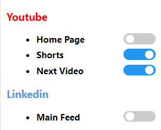

# NoReco
Chrome extension to hide youtube recommendations (all videos on home page, shorts and next section suggestions), so that you will go directly to what you are looking for without beeing distructed.

### Features
- Hide videos in the home page (which are basically suggestions from what you watched before).
- Hide shorts, which are like a poison, they are just there basically to take your attention.
- Hide *"Next Section"* Suggestions, because sometimes when you watch something, you get distructed from right side about suggested videos, and you are no longer focusing on the video that is playing.





# Installation

Clone the repo:
```
git clone git@github.com:ayoubc/no-reco.git
```

Import the folder to chrome:

- go to extensions in chrome
- enable developer mode and click on `Load unpacked` button

